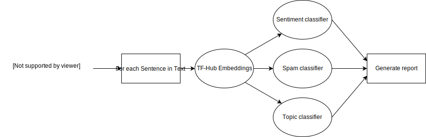

# Secure text analysis

This project aims to create a privacy focused text analysis tool. For this, the following steps are planned:

- Use a Tensorflow hub model to create embeddings from the text to be classified. (Maybe train it with own data). The embeddings then will be send to a remote server for classification. Maybe port the molde to java/C#/go?
- Generate a model for:
    * Sentiment classification
    * Spam classification
    * Topic classification
    
- For optimal models https://autokeras.com/ should be researched.
- Run the classifyer model in the cloud.



### Dev setup:

As of today, pip has to be on the latest version for everything to work corectly:

``pip install -U pip``

Keep in mind that becuase the module ``tensorflow_text``, this project does 
not work on Windows.

Setup venv:

```pip -m venv env```

Install package in development mode:

``pip install -e .``

Using TensorBoard:

* Search for the logdir. Here its "./logs".

``tensorboard --logdir=./logs``

### Example use:

Load training data and train a models on multiple parameters:


```python
from secure_text_classify import train_sentiment
import os

# Initialize Trainer
x = train_sentiment.Train(os.path.dirname(os.path.realpath(__file__)))
# Downloads and prepares data
x.prepare_data()

# Create multiple models with different dropouts and nodes
dropout = [0.2, 0.3, 0.4, 0.6]
nodes = [12, 32, 64, 128]
x.train_on_ranges(dropout, nodes)
```

After training the models select the best one, then you can 
use it to create a simple API:
```python 
from secure_text_classify import serve
import os

# "20191212-145717_nodes-128_dropout-0.3.h5" is the model with the best validation accuracy
serve.serve(os.path.dirname(os.path.realpath(__file__)), "20191212-145717_nodes-128_dropout-0.3.h5")
```

Now you can POST sentences to ``localhost:5000``:

```JSON
{
	"text": "This is fun!"
}
```
It will return a float value where 1 is a very positive sentiment and 0 is a negative sentiment.  